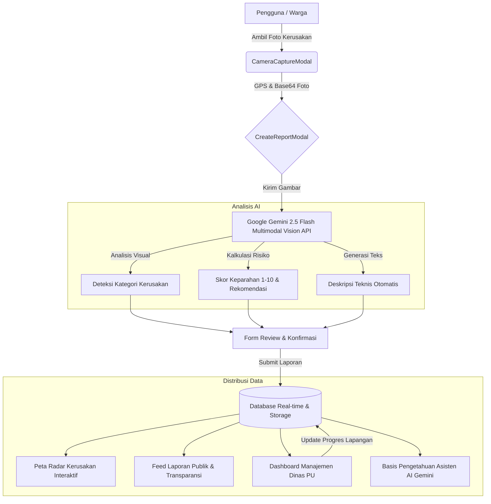

<div align="center">

# 🚧 LaporInfra

### *Sistem Cerdas Pelaporan & Mitigasi Kerusakan Infrastruktur Berbasis Multimodal Vision AI & Geospasial*

[](https://react.dev/)
[](https://www.typescriptlang.org/)
[](https://vitejs.dev/)
[](https://tailwindcss.com/)
[](https://ai.google.dev/)
[](https://leafletjs.com/)
[](https://opensource.org/licenses/MIT)

<br />

> **LaporInfra** adalah platform civic-tech inovatif yang mentransformasi cara warga melaporkan kerusakan fasilitas umum (jalan berlubang, trotoar rusak, jembatan retak, lampu penerangan padam, dan drainase tersumbat). Ditenagai oleh **Google Gemini Multimodal Vision AI**, sistem ini secara otomatis mendeteksi objek kerusakan, mengevaluasi tingkat risiko keselamatan, mengestimasi skor keparahan, serta memetakannya secara geospasial real-time untuk mempercepat tindak lanjut Dinas Pekerjaan Umum (PU).

<br />

[Jelajahi Fitur](#-fitur-unggulan) • [Alur Sistem](#-arsitektur--alur-kerja) • [Teknologi](#-tech-stack) • [Cara Instalasi](#-panduan-instalasi--menjalankan-lokal) • [Dampak SDGs](#-keselarasan-dengan-sdgs)

</div>

---

## 📌 Latar Belakang & Masalah

Kerusakan infrastruktur publik, khususnya jalan raya berlubang dan drainase tersumbat di Indonesia, sering kali memicu kecelakaan fatal, kemacetan, dan kerugian ekonomi bernilai miliaran rupiah setiap tahunnya. Namun, sistem pelaporan konvensional saat ini menghadapi beberapa hambatan mendasar:

1. **Birokrasi Pelaporan Rumit:** Warga enggan melapor karena form pengaduan panjang, lambat, dan tidak intuitif.
2. **Subjektivitas & Kesulitan Triage Manual:** Petugas dinas kewalahan memilah ratusan laporan mana yang darurat (kritis) vs kerusakan minor tanpa data visual yang terstandarisasi.
3. **Minim Validasi Lokasi Presisi:** Laporan sering kali tidak mencantumkan koordinat akurat sehingga tim teknis lapangan sulit menemukan lokasi fisik kerusakan.
4. **Kurangnya Transparansi Publik:** Warga jarang mendapatkan kabar kelanjutan status pengerjaan atas laporan yang telah mereka kirimkan.

---

## 💡 Solusi: Pendekatan LaporInfra

LaporInfra hadir sebagai solusi *end-to-end* yang memadukan **AI Vision**, **Sensor Geolokasi GPS**, dan **Interactive Spatial Mapping**:

```
[Warga Ambil Foto] ➔ [Analisis Vision AI Gemini 2.5] ➔ [Triage Tingkat Keparahan Otomatis] ➔ [Radar Peta Geospasial] ➔ [Dashboard Penanganan Dinas PU]
```

- ⚡ **Zero-Friction Reporting:** Cukup bidik kamera atau unggah foto, AI yang mengisi kategori, deskripsi teknis, dan tingkat keparahannya.
- 🎯 **Triase Risiko Otomatis:** Menghitung skor urgensi 1-10 secara objektif untuk penentuan skala prioritas penanganan dinas terkait.
- 📍 **Peta Radar Geospasial Real-time:** Titik kerusakan langsung terplot di peta interaktif lengkap dengan penanda warna tingkat bahaya.
- 🔍 **Transparansi Berkelanjutan:** Setiap laporan memiliki nomor tiket unik yang dapat dipantau statusnya oleh publik secara terbuka.

---

## ✨ Fitur Unggulan

### 1. 🤖 Multimodal AI Damage Recognition (Google Gemini AI)
- Menggunakan model multimodal canggih untuk menganalisis foto kerusakan infrastruktur dalam hitungan detik.
- Mengklasifikasikan kategori otomatis: *Jalan Berlubang, Jembatan Retak, Trotoar Rusak, Lampu Jalan Mati, Saluran Air Tersumbat, dll.*
- Memberikan penilaian tingkat keparahan (**Ringan**, **Sedang**, **Berat/Kritis**) dengan skor bahaya 1-10.
- Menghasilkan deskripsi teknis dan rekomendasi perbaikan darurat untuk petugas lapangan.

### 2. 🗺️ Peta Radar Geospasial Interaktif (Interactive Radar Map)
- Pemetaan visual titik kerusakan menggunakan Leaflet & OpenStreetMap (ringan, cepat, dan bebas API key berbayar).
- Filter interaktif berdasarkan tingkat keparahan, status penanganan, dan kategori infrastruktur.
- Klik penanda kerusakan untuk membuka panel detail laporan lengkap dan ringkasan audit kecerdasan buatan.

### 3. 📸 Live Camera Capture & GPS Geolocation
- Tangkapan kamera langsung dari browser mobile atau desktop dengan pengoptimalan kompresi gambar.
- Deteksi koordinat GPS presisi pengguna dan *reverse geocoding* otomatis untuk mengenali nama jalan, kecamatan, dan kota di Indonesia.
- Opsi pemilihan kota preset dan sampel foto uji coba (*Quick Demo Mode*) untuk kemudahan demonstrasi juri.

### 4. 💬 Asisten AI Infrastruktur Terpadu (Gemini Chatbot)
- Chatbot cerdas terintegrasi penuh yang memiliki pemahaman terhadap data laporan terkini di platform.
- Warga dapat menanyakan estimasi waktu pengerjaan jalan, standar keselamatan PU, cara pelaporan, maupun kontak dinas terkait.
- Tampilan antarmuka modern yang bersih dan intuitif (gaya ChatGPT/Gemini).

### 5. 🏢 Dashboard Manajemen Dinas PU & Super Admin
- Panel kendali terintegrasi bagi petugas pemerintah dan dinas terkait untuk mengubah status penanganan (*Baru* ➔ *Terverifikasi* ➔ *Dalam Penanganan* ➔ *Selesai*).
- Manajemen tim lapangan dan catatan tindak lanjut perbaikan.
- Filter analitik total laporan, persentase penyelesaian, dan sebaran titik kritis.

### 6. 🌓 Dual Mode Tampilan (Dark Mode & Light Mode)
- Desain antarmuka modern, bersih, dan kontras tinggi.
- Palet warna kuning-emas *infrastructure warning* yang khas, dipadukan dengan mode gelap elegan untuk kenyamanan navigasi malam hari.

---

## 🏗️ Arsitektur & Alur Kerja



---

## 💻 Tech Stack

| Layer | Teknologi | Keterangan |
|---|---|---|
| **Frontend Framework** | **React 19** | Library UI modern dengan performa tinggi |
| **Language** | **TypeScript 5.8** | Type-safety penuh untuk arsitektur yang kokoh |
| **Styling & Design** | **Tailwind CSS v4** | Utility-first CSS dengan fluid dark/light styling |
| **Build Tool** | **Vite 6.2** & **esbuild** | Fast refresh, optimized bundling, dan build kilat |
| **Artificial Intelligence** | **Google Gemini AI (`@google/genai`)** | Vision Multimodal 2.5 Flash untuk deteksi infrastruktur |
| **Geospatial & Maps** | **Leaflet** & **OpenStreetMap** | Peta interaktif bebas kuota dan tanpa ketergantungan API key |
| **Icons & Animation** | **Lucide React** & **Motion** | Ikonografi modern dan transisi animasi mulus |
| **Backend & Runtime** | **Node.js** & **Express** | Server API dengan TypeScript loader (`tsx`) |
| **Database & Auth** | **Firebase Firestore & Auth** | Penyimpanan real-time dan autentikasi aman |

---

## 🎯 Keselarasan dengan SDGs (Sustainable Development Goals)

LaporInfra secara langsung mendukung agenda pembangunan berkelanjutan PBB (United Nations SDGs):

<table>
  <tr>
    <td align="center" width="120px">
      
    </td>
    <td>
      <strong>SDG 9: Industry, Innovation, and Infrastructure</strong><br />
      <em>Target 9.1:</em> Membangun infrastruktur yang berkualitas, andal, berkelanjutan, dan tangguh melalui adopsi kecerdasan buatan dan integrasi data geospasial guna mendukung pemerataan keselamatan jalan.
    </td>
  </tr>
  <tr>
    <td align="center" width="120px">
      
    </td>
    <td>
      <strong>SDG 11: Sustainable Cities and Communities</strong><br />
      <em>Target 11.2 & 11.3:</em> Menyediakan akses ke sistem transportasi yang aman, terjangkau, dan berkelanjutan untuk semua kalangan, serta memperkuat partisipasi warga kota dalam tata kelola fasilitas publik (Smart Governance).
    </td>
  </tr>
</table>

---

## 🚀 Panduan Instalasi & Menjalankan Lokal

### Prasyarat
- [Node.js](https://nodejs.org/) versi 18 atau lebih tinggi
- [Git](https://git-scm.com/)
- Kunci API Google Gemini (dapat diperoleh gratis di [Google AI Studio](https://aistudio.google.com/))

### 1. Clone Repositori
```bash
git clone https://github.com/DarkIgnite/LaporInfra.git
cd LaporInfra
```

### 2. Pasang Dependensi
```bash
npm install
```

### 3. Konfigurasi Environment Variables
Salin berkas `.env.example` menjadi `.env`:
```bash
cp .env.example .env
```

Buka berkas `.env` dan masukkan API Key Google Gemini:
```env
# Google Gemini AI API Key (Wajib untuk fitur Vision AI & Chatbot)
GEMINI_API_KEY="masukkan_api_key_gemini_anda_di_sini"

# Port server (opsional, default: 3000)
PORT=3000
```

### 4. Jalankan Aplikasi (Mode Development)
```bash
npm run dev
```
Buka browser dan akses aplikasi di: `http://localhost:3000`

### 5. Build untuk Produksi
```bash
npm run build
npm run start
```

---

## 📂 Struktur Direktori Proyek

```text
LaporInfra/
├── public/                     # Aset statis & favicon
├── src/
│   ├── components/             # Komponen UI React
│   │   ├── AIAssistantView.tsx     # Tampilan halaman utama chatbot Gemini
│   │   ├── AdminDashboard.tsx      # Dashboard dinas & monitoring penanganan
│   │   ├── CameraCaptureModal.tsx  # Modal jepret kamera & upload gambar
│   │   ├── CreateReportModal.tsx   # Modal pembuatan laporan bertenaga AI
│   │   ├── DamageMap.tsx           # Komponen peta radar geospasial (Leaflet)
│   │   ├── GeminiChatbot.tsx       # Mesin chat interaktif dengan AI
│   │   ├── LandingPage.tsx         # Halaman beranda & etalase fitur utama
│   │   ├── Navbar.tsx              # Navigasi responsif dengan toggle tema
│   │   ├── PublicReportGrid.tsx    # Feed kartu laporan publik transparan
│   │   ├── ReportDetailModal.tsx   # Popup detail inspeksi laporan
│   │   └── SDGInfoModal.tsx        # Edukasi keselarasan target SDGs
│   ├── context/                # Context state management (Auth, Theme)
│   ├── services/               # Integrasi API (Google Gemini, Firebase)
│   ├── types/                  # Definisi antarmuka TypeScript
│   ├── utils/                  # Utilitas kalkulasi, geolokasi, dan format
│   ├── App.tsx                 # Root komponen aplikasi
│   ├── main.tsx                # Entry point React
│   └── index.css               # Styling kustom & integrasi Tailwind v4
├── server.ts                   # Backend API server (Express & static server)
├── package.json                # Dependensi & script proyek
└── README.md                   # Dokumentasi proyek
```

---

## 🔮 Rencana Pengembangan Lanjutan (Roadmap)

- [ ] **Sensor Accelerometer Smartphone:** Deteksi lubang jalan secara otomatis saat pengguna berkendara menggunakan sensor giroskop/akselerometer gawai.
- [ ] **WhatsApp & Telegram Reporting Bot:** Pelaporan instan melalui aplikasi pesan instan dengan integrasi Gemini OCR & vision webhook.
- [ ] **AI Budget Estimation (RAP Otomatis):** Estimasi kebutuhan material (aspal, paving block) dan perkiraan anggaran biaya perbaikan jalan langsung dari foto.
- [ ] **Integrasi API Satu Data Indonesia:** Sinkronisasi data laporan langsung ke sistem pengaduan nasional (LAPOR! / SP4N).

---

## 📄 Lisensi

Proyek ini dilisensikan di bawah [MIT License](LICENSE). Bebas digunakan, dikembangkan, dan didistribusikan untuk kepentingan kemajuan infrastruktur publik.

---

<div align="center">
  <sub>Dibuat dengan ❤️ untuk kemajuan infrastruktur Indonesia yang lebih aman, cerdas, dan berkelanjutan.</sub>
</div>
